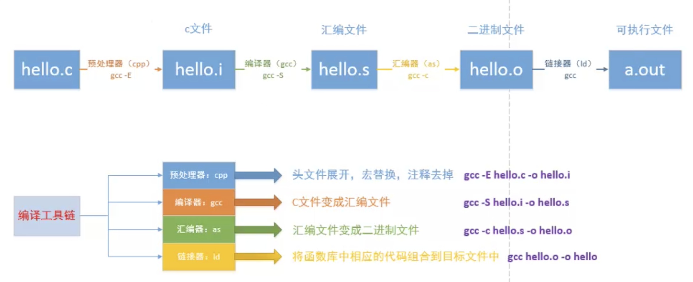

## Linux命令行

- 历史命令上下滚动
  - 上：Ctrl+p
  - 下：Ctrl+n
  - 查看历史命令：history
- 命令行前后移动
  - 最前：Ctrl+a
  - 最后：Ctrl+e
- 自动填充：Tab（按两下显示可填充内容）

# Linux文件操作

## 常用文件操作命令

### cd

- ~：家目录，/home/UserName/，直接按cd也可切换为家目录
- -：目录切换
- 相对路径和绝对路径

### pwd：打印当前目录

### ls

常用： ll -lrth

- -l：显示详细信息
- -h：方便人好读的文件大小
- -a：显示隐藏文件

> ### 文件或目录颜色情况
> <font color=white>白色——普通文件</font>
> <font color=blue>蓝色——目录</font>
> <font color=green>绿色——可执行文件</font>
> <font color=red>红色——压缩文件</font>
> <font color=cyan>青色——链接文件</font>
> <font color=yellow>黄色——设备文件</font>
> <font color=grey>灰色——其他文件</font>


### tree：显示文件树

### mkdir：创建目录

- mkdir dir
- mkdir dir1/dir2/dir3 **-p**  *创建嵌套目录需要加-p*

### rm：删除

- -r：递归删除，用于删除非空目录
- -i：增加提示信息

### touch：创建新文件

- 若文件已存在，会刷新其创建时间，不改变内容

### cp：拷贝

- cp 待拷贝文件 目标文件（若目标文件已存在，会覆盖原有内容）
- -r：拷贝目录时需要使用，递归拷贝

### cat：查看文件内容

### more：显示大部分内容

### less：显示小部分内容

### head：显示头部

- -n 显示前n行

### tail：显示尾部

- -n 显示后n行

### mv：移动

- 可用于重命名

### ln：创建链接

- 直接ln：创建硬链接
- -s：创建软连接（快捷方式）
- eg ：ln （-s） file newfile

### od、wc、du、df

- od——查看二进制文件
- wc——显示文件文本信息
- du——查看某个目录的大小，加上-h
  - -d N 计算深度
  - du -sh * 当前目录下所有文件(文件夹)大小，du -sh * | sort -rh

- df——查看磁盘的使用情况，加上-h
  - df -lh，大小
  - df -ih，节点


### which

查看指定命令存在的路径

### file

查看文件类型

### ulimit -a

查看进程使用的资源上限

### strace 

追踪可执行文件运行时使用的系统调用

### dd 

- 用指定大小的块拷贝文件，将大文件切成多个小文件
- 应用：几十个G的文件中查找一个字符串是否存在
- if：输入文件名  of：输出文件名(缺省为标准输出)
- ibs：一次读入字节数，obs， bs
- skip：跳过开头块数
- count：仅拷贝块数
- if=model_20200423155728 bs=1024 skip=3600000 count=1200 | grep '4222019284714124'

## 文件权限

### chmod 修改文件权限

- 文字设定法——chmod [who] [+-=] [mode] filename
  - who
    - 文件所有者：u
    - 文件所属组：g
    - 其他人：o
    - a：所有人
  - =：覆盖原有权限
  - mode
    - r：读
    - w：写
    - x：执行
- 数字设定法  chmod xxx filename（xxx分别代表ugo）
  - -：没有权限
  - r：4
  - w：2
  - x：1

### chown 修改文件所属用户

- 通常需要sudo
- chown Luffy:lisi temp——将temp的所属用户改为Luffy，所属组改为lisi

### chgrp 修改文件所属组

- sudo chgrp groupname file

### 目录必须有执行权限

## 文件查找

### 按文件属性查找

- 文件名——find 查找的目录 -name "文件名字"
  - 通配符：*代表任意多个字符，?代表一个字
- 文件大小——find 查找的目录 -size +10k(M) -size -11k(M)
- 文件类型——find 查找的目录 -type+d/f/b/c/s/p

### 按文件内容查找

- grep -r "查找的内容" 查找的目录

## 软件安装

### 在线安装 apt-get

### deb包安装

- 安装——sudo dpkg **-i** xxx.deb
- 卸载——sudo dpkg **-r** xxx

### 源码安装 参见ReadME

## U盘挂载

U盘插入时，自动挂载到/media中。

- 卸载：umount 路径（必须在外设路径之外）
- 挂载：mount deviceName 路径
- 使用sudo fdisk -l查看外设信息（deviceName）
- 一般挂载到/mnt中（空目录）

## 压缩包管理

### gzip和bzip2

- gzip——.gz格式
- bzip2——.bz2格式

### tar

- 参数
  - c——创建——压缩
  - x——释放——解压缩
  - v——显示提示信息
  - f——指定压缩文件名字
  - z——使用gzip的方式压缩——.gz
  - j——使用bzip2的方式压缩——.bz2
- 压缩例子：
  - tar zcvf 压缩包名字（xxx.tar.gz） 要压缩的文件or目录
  - tar jcvf 压缩包名字（xxx.tar.bz2） 要压缩的文件or目录
- 解压缩：
  - tar jxvf 压缩包名字（xxx.tar.bz2）
  - tar jxvf 压缩包名字（xxx.tar.bz2）-C 要放置的目录

### rar（需用户手动安装）

- 参数
  - 压缩——a
  - 解压缩——x
- 压缩
  - rar a 生成的压缩文包名字（temp） 要压缩的文件or目录
- 解压缩
  - rar x 压缩包名字 要放置的目录

### zip

- 打包
  - 对目录打包要加-r
  - zip -r 压缩包名字 打包的目录
- 解包
  - unzip dir.zip -d 指定目录

## 进程相关

### tty

- Ctrl+alt+F1~F7切换中断
- tty1—tty6为文字终端，tty7为图形终端

### ps

- a——列出当前用户信息
- u——显示更详细的信息
- x——列出无终端用户的信息
- 一般aux结合使用
- | ——管道，过滤使用
  - ps aux | grep xxx

### kill

- kill -9 PID
- kill -l——查看信号

### env 查看环境变量

- env | grep PATH

### top 任务管理器

### 孤儿进程和僵尸进程

- 孤儿进程：父进程已结束，子进程还未结束，此时子进程交给pid为1的init进程托管（安全的）
- 僵尸进程，父进程尚在运行，子进程已经结束，但未被父进程回收
  - 父进程通过调用wait或waitpid回收子进程
  - wait会阻塞，waitpid可以设置不阻塞


## 网络相关

### ifconfig

### ping

- ping xxx.xxx.xxx.xxx -c 4

### nslookup 查看域名对应ip

### netstat

|  参数    |   说明   |
| :--: | :--: |
|-a (all)|	显示所有选项，默认不显示LISTEN相关|
|-t (tcp)	|仅显示tcp相关选项|
|-u (udp)	|仅显示udp相关选项|
|-n	|拒绝显示别名，能显示数字的全部转化成数字|
|-l	|显示所有监听的端口|
|-p	|显示建立相关链接的程序名|
|-r	|显示路由信息，路由表|
|-e	|显示扩展信息，例如uid等|
|-s	|按各个协议进行统计|
|-c	|每隔一个固定时间，执行该netstat命令|

### nc和telnet

#### telnet

连接服务器端口，远程控制服务器

#### nc

1. 监听服务器端口，nc -l [端口]
2. 端口扫描，nc -nvz 127.0.0.1 500-505，判断远端服务的端口是否开启
3. 连接服务器端口，nc [服务器地址] [端口]
4. 发送文件，nc [服务器地址] [端口] < [文件名]

## 用户管理

### 创建用户

- sudo adduser 用户名
- sudo useradd
  - -s /bin/bash（shell类型）
  - -g +所属用户组，该组必须已经存在
  - -d /home/xxx 用户家目录
  - -m 用户家目录不存在时，自动创建该目录

### 赋予sudo权限

- 赋予sudoer文件写权限
- sudo chmod u+w /etc/sudoers
- 编辑sudoers文件，给对应的用户添加sudo权限
- sudo vi /etc/sudoers
- root	ALL=(ALL:ALL) ALL
- A	ALL=(ALL:ALL) ALL

### 设置用户组

- sudo groupadd xxx

### 删除用户

- sudo deluser 用户名
- sudo userdel -r xxx
  - -r	把用户主目录一起删除

### 切换用户

- su 用户名

## man——九个章节

- :one:**可执行程序或shell命令**
- :two:**系统调用（内核提供的函数）**
- :three:**​库调用（程序库提供的函数）**
- :four:特殊文件（/dev）
- :five:文件格式和规范（eg：/etc/passwd）
- :six:游戏
- :seven:杂项
- :eight:系统管理命令
- :nine:内核例程

## vim

## gcc



- -o：指定生成文件的名字
- -I：指定头文件路径（大写i）eg：gcc -I./include main.cc -o main
- -D：指定宏名字 eg：gcc main.c -o main -D DEBUG
- -O：指定优化等级，0、1、2、3（0最低，3最高）
- -Wall：提示警告
- -g：添加调试信息，用于gdb

## 静态库

### 命名规则

- lib+库的名字+.a
  - eg:libmytest.a

### 制作步骤

- 生成对应的.o文件——gcc -c mytest.c -o 
- 将生成的.o文件打包   ar rcs + 静态库名字（libMytest.a） + 所有.o

### 发布和使用静态库

- 将静态库和头文件交付给第三方
- 第三方使用静态库
  - eg1：gcc main.c lib/libMyCalc.a -o main
  - eg2：gcc main.c -L lib -l MyCalc -o main
    - -L：指定静态库目录
    - -l：指定库名字（掐头去尾，~~lib，.a~~）

### nm 查看符号|objdump

## 动态库（共享库）

### 命名规则

- lib+名字+.so

### 制作步骤

- 生成与位置无关的代码（生成**与位置无关**的.o）
- 将.o打包成动态库
  - gcc **-fPIC** -c mytest.c
  - gcc -shared -o libmytest.so libmytest.o

### 发布和使用动态库

- 将静态库和头文件交付给第三方
- 第三方使用静态库
  - gcc main.c libmytest.so -o main
  - gcc main.c -L lib -l mytest -o main
  - 需要将.so放在/lib目录中或 设置export LD_LIBRARY_PATH=
  - 若需永久设置LD_LIBRARY_PATH，可修改~/.bashrc
  - **推荐：**或者修改/etc/ld.so.conf，然后执行sudo ldconfig -v

### 使用动态库

- ldd+可执行文件
  - 查看该程序需要链接的动态库,检查动态库依赖关系
- 为自制共享库添加路径
  - 修改环境变量 LD_LIBRARY_PATH
    - 临时：export LD_LIBRARY_PATH=$LD_LIBRARY_PATH:动态库路径
    - 用户级别：在~目录下的.bashrc中，加入上面这句
    - 系统级别:sudo vim /etc/profile 尾部加入上面这句

## gdb

- l——查看源代码
  - l 文件名:行号
  - l 文件名:函数名
- b——设置断点（break）
  - b 行号
  - 条件断点：b 15 if i==15
- i——查看信息（info）
  - i b——查看断点信息
- start——开始调试，只执行一步
- r——开始调试，直到断点（run）
- n——next，执行一行
- c——继续执行（直到断点）
- s——step，下一步
- p——查看变量值
- ptype——查看变量类型
- display——每次都打印变量值，追踪变量
- undisplay——取消追踪变量
  - 后面跟编号
  - 利用info display查看变量编号
- u——跳出循环
- finish——跳出当前函数
- d——删除断点（delete）
  - 后面更断点编号，用info查看
- set var i=10——设置变量值
- quit——退出调试

### 多进程调试

- set follow-fork-mode child 在fork之后追踪子进程
- set follow-fork-mode parent 跟踪父进程
- 必须在fork之前设置才有效
- set detach-on-fork [on|off] 调试当前进程时，其他进程是否继续运行
- info inferiors 查看调试的进程
- 切换当前调试的进程 inferior id
- 使进程脱离GDB调试 detach inferiors id

## makefile

- 命名方式：makefile或Makefile

### 规则

- 三要素：目标、依赖、命令
  - 目标：依赖
    - 命令（严格缩进，一个Tab）

```makefile
app:main.c add.c sub.c mul.c
	gcc main.c add.c sub.c mul.c -o app
```

- 更新版（每次只编译更新的.c）

```makefile
app:main.o add.o sub.o mul.o
	gcc main.o add.o sub.o mul.o -o app
main.o:main.c
	gcc -c main.c main.o
add.o:add.c
	gcc -c add.c add.o
sub.o:sub.c
	gcc -c sub.c sub.o
mul.o:mul.c
	gcc -c mul.c mul.o
```

- 加强版（使用变量）
  - %.o——模式匹配，app查找依赖时自动匹配%为main、add……
  - 自动变量（只能在规则的命令中使用）
    - $<——规则中的第一个依赖（main.c）
    - $@——规则中的目标（main.o）
    - $^——规则中的所有依赖

```makefile
target = app
obj = main.o add.o sub.o mul.o
$(target):$(obj)
	gcc $(file) -o $(target)
%.o:%.c
	gcc -c $< -o $@
```

## 虚拟地址空间


### cpu为什么要使用虚拟地址空间和物理地址空间映射？解决了什么问题？

- 方便编译器和操作系统安排程序的地址分布
  - 一个进程使用的物理内存往往不相邻
- 方便进程间隔离
  - 不同进程只能访问自己的内存
- 当内存用满时，可以换页

### MMU内存管理单元

- 用于完成虚拟地址到物理地址的映射
- 修改内存访问级别
- **三级映射**


### PCB进程控制块

- 进程id
- 进程状态，就绪、运行、挂起、停止
- 进程切换时需要保存和恢复的CPU寄存器
- 描述**虚拟地址空间**的信息
- 描述控制终端的信息
- 当前工作目录
- umask掩码
- 文件描述符表
- 用户id和组id
- 会话和进程组
- 进程可以使用的资源上限

### fork()

- 返回0——子进程
- 返回>0——父进程
- 父子进程遵循**读时共享写时复制**原则
- 父子进程共享内容：1. 文件描述符，2.mmap建立`的映射区

###  exec函数族

fork()之后，加载新的程序

### wait()

回收子进程

### 进程间通信（IPC）

- 匿名管道，数据放在内核区，双向半双工，伪文件，仅父子进程间可通信
  - int pipe(int pipefd[2]);
- 有名管道，通过FIFO文件，进程之间均可通信
- mmap，创建映射区
  - 匿名映射，不需要实体文件，仅父子进程
- 信号
- 共享内存

### 配置代理

export https_proxy=http://127.0.0.1:7890

sudo echo -ne '\x90\x90' | sudo dd of=/usr/bin/gdb seek=$((0x335C7D)) bs=1 count=2 conv=notrunc
