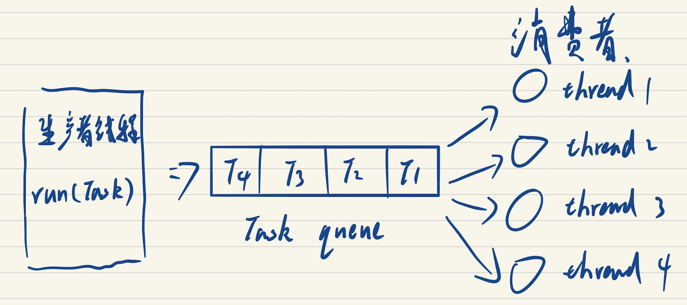
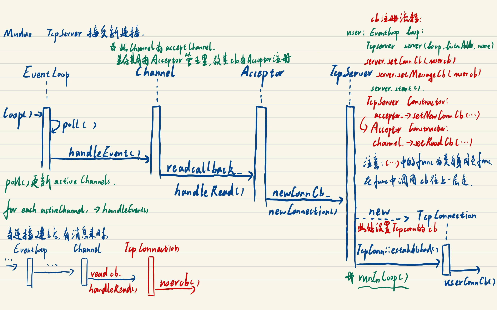
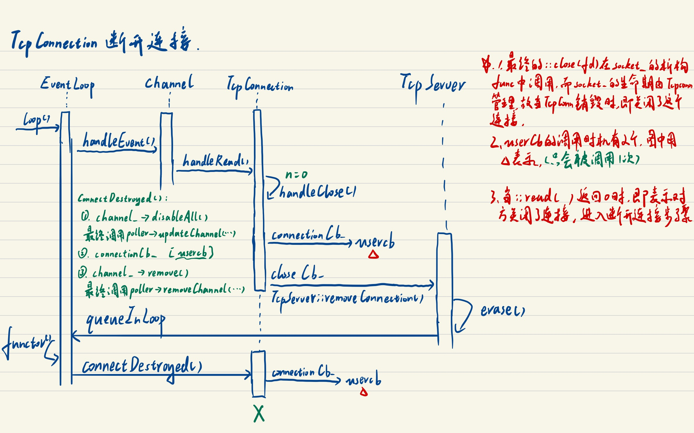

# muduo学习

## 面向对象与基于对象的编程风格对比

以TcpServer为例，当client连接到来时，TcpSever需要回调`OnConnection、OnMessage、OnClose`三种不同的方法，假设这三个方法需要用户自行编写，则两种编程风格对比如下：

### 面向对象

```cpp
/*
	用MySever继承TcpSever抽象类，实现三个接口
*/
class TcpServer{
public:
	...
private:
	virtual void OnConnection(...);
	virtual void OnMessage(...);
	virtual void OnClose(...);
}

class MyServer:TcpServer{
public:
    ...
private:
    void OnConnection(...);
    void OnMessage(...);
    void OnClose(...);
}
```

### 基于对象

```cpp
/*
	MySever包含TcpSever类，在构造函数中用std::bind注册三个成员函数(c风格则为全局函数)
*/
class MyServer{
public:
    MyServer(){
        server.SetConnectionCallback(std::bind(OnConnection,this));
        server.SetMessageCallback(std::bind(OnMessage,this));
        server.SetCloseCallback(std::bind(OnClose,this));
    }
    void OnConnection(...);
    void OnMessage(...);
    void OnClose(...);
    TcpServer server;
    ...
}
```


## base库

### 1. Timestamp

实现微秒级时间戳，仅含有一个64位整型成员变量。

```c++
private:

  int64_t microSecondsSinceEpoch_;
```

#### 1.1 关于操作符重载：

Timestamp类继承自boost的equality_comparable和less_than_comparable，这两个类中将运算符重载声明为友元函数

```c++
template <class T, class B = operators_detail::empty_base<T> >
struct less_than_comparable1 : B
{
     friend BOOST_OPERATORS_CONSTEXPR bool operator>(const T& x, const T& y)  { return y < x; }
     friend BOOST_OPERATORS_CONSTEXPR bool operator<=(const T& x, const T& y) { return !static_cast<bool>(y < x); }
     friend BOOST_OPERATORS_CONSTEXPR bool operator>=(const T& x, const T& y) { return !static_cast<bool>(x < y); }
};
```

所以只需要在类外定义< and ==的运算符重载即可实现其他部分。**（也可以类内重载）**

```c++
inline bool operator<(Timestamp lhs, Timestamp rhs)
{
  return lhs.microSecondsSinceEpoch() < rhs.microSecondsSinceEpoch();
}

inline bool operator==(Timestamp lhs, Timestamp rhs)
{
  return lhs.microSecondsSinceEpoch() == rhs.microSecondsSinceEpoch();
}
```

#### 1.2 获取当前时刻

Timestamp中含有静态成员函数` static Timestamp now();`

```c++
Timestamp Timestamp::now()
{
  struct timeval tv;
  gettimeofday(&tv, NULL);
  int64_t seconds = tv.tv_sec;
  return Timestamp(seconds * kMicroSecondsPerSecond + tv.tv_usec);
}
```

`struct timeval`内部含有两个整数，分别表示s和us，gettimeofday系统调用获取当前时间，返回的`seconds * kMicroSecondsPerSecond + tv.tv_usec`即微秒级别的时间戳。

#### 1.3 获取时间差和增加时间

Timestamp头文件中提供两个全局函数`inline double timeDifference(Timestamp high, Timestamp low)`和`inline Timestamp addTime(Timestamp timestamp, double seconds)`，分别用于获取时间差和增加时间。

```c++
inline double timeDifference(Timestamp high, Timestamp low)
{
  int64_t diff = high.microSecondsSinceEpoch() - low.microSecondsSinceEpoch();
  return static_cast<double>(diff) / Timestamp::kMicroSecondsPerSecond;
}

///
/// Add @c seconds to given timestamp.
///
/// @return timestamp+seconds as Timestamp
///
inline Timestamp addTime(Timestamp timestamp, double seconds)
{
  int64_t delta = static_cast<int64_t>(seconds * Timestamp::kMicroSecondsPerSecond);
  return Timestamp(timestamp.microSecondsSinceEpoch() + delta);
}

```

### 2. Atomic（原子操作）

该头文件中包含AtomicIntegerT类，该类采用模板，含有一个成员变量。

```c++
 private:
  volatile T value_;
```

> volatile提醒编译器它后面所定义的变量随时都有可能改变，因此编译后的程序每次需要存储或读取这个变量的时候，都会直接从**变量地址**中读取数据。如果没有volatile关键字，则编译器可能优化读取和存储，可能暂时**使用寄存器中的值**，如果这个变量由别的程序更新了的话，将出现不一致的现象。

该类使用两个系统调用实现原子操作

```c++
  T get()
  {
    // in gcc >= 4.7: __atomic_load_n(&value_, __ATOMIC_SEQ_CST)
    return __sync_val_compare_and_swap(&value_, 0, 0);
  }

  T getAndAdd(T x)
  {
    // in gcc >= 4.7: __atomic_fetch_add(&value_, x, __ATOMIC_SEQ_CST)
    return __sync_fetch_and_add(&value_, x);
  }
```

get()函数获取当前值，getAndAdd(T x)为先获取后自增，由这两个原子操作可以得到++、--等加减原子操作。

#### 2.1 无锁队列（CAS）

参考https://coolshell.cn/articles/8239.html

链表实现，进队方式

```cpp
EnQueue(x){
    // 准备新节点
	q = new node();
	q->value = x;
	q->next = NULL;
	do{
		p = tail; // 取尾结点
	}while(CAS(p->next,NULL,q) != TRUE); 
    /* CAS(p->next,NULL,q) 将下面的if-else看作原子操作，不会被其他线程打断
    	if(p->next == NULL){
    		p->next = q;
    		return true;
    	}
    	else return false;
    */
    CAS(tail,p,q); // 更新尾结点，不需要判断，只要跳出while循环，该函数必执行成功。
}
```

### Exception

主要知识点：系统调用`backtrace`和`backtrace_symbols`，函数名字mangle和demangle

`Exception`类用于抛出异常，其继承自`std::exception`，用法如下：

```cpp
void foo()
{
	throw muduo::Exception("oops");
}
int main(){
    try{
        foo();
    }
    catch(const muduo::Exception& ex){
        printf("reason: %s\n", ex.what()); // reason:oops
        printf("stack trace: %s\n", ex.stackTrace()); // 输出栈追踪
        /*
        reason: oops
    stack trace: /home/cky/muduo_server_learn/src/12/jmuduo/build/bin/exception_test(_ZN5muduo9Exception14fillStackTraceEv+0x43) [0x55f64c3638b5]
    /home/cky/muduo_server_learn/src/12/jmuduo/build/bin/exception_test(_ZN5muduo9ExceptionC2EPKc+0xaf) [0x55f64c36364d]
    /home/cky/muduo_server_learn/src/12/jmuduo/build/bin/exception_test(_ZN3Bar4testEv+0x32) [0x55f64c363568]
    /home/cky/muduo_server_learn/src/12/jmuduo/build/bin/exception_test(_Z3foov+0x27) [0x55f64c363470]
    /home/cky/muduo_server_learn/src/12/jmuduo/build/bin/exception_test(main+0x12) [0x55f64c363499]
    /lib/x86_64-linux-gnu/libc.so.6(+0x29d90) [0x7fdde7ea8d90]
    /lib/x86_64-linux-gnu/libc.so.6(__libc_start_main+0x80) [0x7fdde7ea8e40]
    /home/cky/muduo_server_learn/src/12/jmuduo/build/bin/exception_test(_start+0x25) [0x55f64c363385]
        */
    }
}
```


### 3.  互斥锁和条件变量

Mutex.h和Condition.h分别实现了互斥锁和条件变量

#### 3.1 互斥锁

Mutex.h封装了两个类`class MutexLock`和`class MutexLockGuard`。

##### 关于MutexLock的实现

MutexLock类中含有两个成员变量和一个内部类。

```c++
class UnassignGuard : noncopyable
pthread_mutex_t mutex_;
pid_t holder_;
```

`class UnassignGuard`留给条件变量使用。

MutexLock提供4个外部访问接口

```c++
  bool isLockedByThisThread() const
  {
    return holder_ == CurrentThread::tid();
  }

  void assertLocked() const ASSERT_CAPABILITY(this)
  {
    assert(isLockedByThisThread());
  }

  void lock()

  void unlock()
```

加锁过程会调用`pthread_mutex_lock(&mutex_)`，并且将holder_设置为加锁线程的tid，解锁过程反之亦然。

---

##### 基于RAII实现自动加锁解锁

MutexLockGuard类中包含一个MutexLock（组合关系），基于RAII实现自动加锁解锁。

> ```c++
> // Use as a stack variable, eg.
> 
>  int Foo::size() const
> 
>  {
> 
>    MutexLockGuard lock(mutex_);
> 
>    return data_.size();
> 
>  }
> ```

MutexLockGuard的定义必须分配一个互斥锁，在其构造函数和析构函数中实现对锁的持有与释放，从而实现RAII。

```c++
class MutexLockGuard : noncopyable
{
 public:
  explicit MutexLockGuard(MutexLock& mutex)
    : mutex_(mutex)
  {
    mutex_.lock();
  }

  ~MutexLockGuard() RELEASE()
  {
    mutex_.unlock();
  }

 private:

  MutexLock& mutex_;
};
```

---

#### 3.2 条件变量

- 使用方法

  - Thread1 调用 cond.wait()，进入阻塞，等待条件到来
  - Thread2 调用 cond.notify()或者notifyAll()唤醒等待条件的线程

- 具体过程

  - Thread1

    锁住mutex

    ​		while（用户条件）{cond.wait()}

    解锁mutex

  - Thread2

    锁住mutex

    ​		更改条件[cond.notify()或者notifyAll()]

    解锁mutex

- cond.wait()里面发生了什么？

  1. 解锁mutex
  2. 等待条件（阻塞）
  3. 加锁mutex

- cond.notify()中发生了什么？

  唤醒条件（发送信号）

---

`class Condition`中包含两个成员变量。

```c++
 private:
  MutexLock& mutex_;
  pthread_cond_t pcond_;
```

提供三个接口供外部调用

```c++
  void wait()
  {
    MutexLock::UnassignGuard ug(mutex_);
    MCHECK(pthread_cond_wait(&pcond_, mutex_.getPthreadMutex()));
  }

  // returns true if time out, false otherwise.
  bool waitForSeconds(double seconds);

  void notify()
  {
    MCHECK(pthread_cond_signal(&pcond_));
  }

  void notifyAll()
  {
    MCHECK(pthread_cond_broadcast(&pcond_));
  }
```

#### 3.3 CountDownLatch

实现一个等待计数的类

```c++
class CountDownLatch : noncopyable
{
 public:

  explicit CountDownLatch(int count);

  void wait();

  void countDown();

  int getCount() const;

 private:
  mutable MutexLock mutex_;
  Condition condition_ GUARDED_BY(mutex_);
  int count_ GUARDED_BY(mutex_);
};
```

主线程调用wait()，当count_减至0是唤醒条件。

### `4`. 线程相关类

#### 4.1 CurrentThread

CurrentThread命名空间中包含4个全局变量。

```c++
namespace CurrentThread
{
  // internal
  extern __thread int t_cachedTid;
  extern __thread char t_tidString[32];
  extern __thread int t_tidStringLength;
  extern __thread const char* t_threadName;
}
```

extern关键字表示该变量将会在后面或其他文件中定义。__thread关键字表示该变量是**线程私有**的。

CurrentThread命名空间还提供几个全局函数供外部接口访问。

```c++
  inline int tid() // 当前线程id
  inline const char* tidString() // for logging
  inline int tidStringLength() // for logging
  inline const char* name()
  bool isMainThread();
  string stackTrace(bool demangle);
```

其中tid()调用cacheTid()实现对上面全局变量的更新，最底层调用`return static_cast<pid_t>(::syscall(SYS_gettid));`实现。

***Ps     cacheTid()和isMainThread()两个函数的定义在Thread.cc中实现。***

---

#### 4.2 Thread.h


Class Thread对线程进行封装，其构造函数需要传递线程函数和线程名称。

```c++
Thread::Thread(ThreadFunc func, const string& n)
  //typedef std::function<void ()> ThreadFunc;
  //typedef boost::function<void ()> ThreadFunc;两种做法
  : started_(false),
    joined_(false),
    pthreadId_(0),
    tid_(0),
    func_(std::move(func)),//move为右值引用
    name_(n),
    latch_(1)//用于等待线程启动
{
  setDefaultName();//构造函数的第二个参数有设置默认值string()，若未设置线程名，此处将为其赋值默认名
  //snprintf(buf, sizeof buf, "Thread%d", num);
}
```

通过调用thread.start()和thread.join()实现线程启动和阻塞。

##### Thread::start()实现原理

```c++
void Thread::start()
{//……
  detail::ThreadData* data = new detail::ThreadData(func_, name_, &tid_, &latch_);//新建一个ThreadData对象，将Thread类中的线程函数等参数传入该对象。
  if (pthread_create(&pthreadId_, NULL, &detail::startThread, data))//将data作为参数传入全局函数startThread（void *)    
  {
    //thread start failed……
  }
  else
  {
    latch_.wait();//等待线程启动
    assert(tid_ > 0);
  }
}

void* startThread(void* obj)//ThreadData*隐式转换为void*
{
  ThreadData* data = static_cast<ThreadData*>(obj);//再转回ThreadData*，实现绑定
  data->runInThread();
  delete data;
  return NULL;
}

void ThreadData::runInThread()
  {
    *tid_ = muduo::CurrentThread::tid();
    tid_ = NULL;
    latch_->countDown();//唤醒主线程
    latch_ = NULL;

    muduo::CurrentThread::t_threadName = name_.empty() ? "muduoThread" : name_.c_str();
    ::prctl(PR_SET_NAME, muduo::CurrentThread::t_threadName);//设置进程名称
    try
    {
      func_();//用户定义的子线程函数
    }
  //exception……
	}
```

~~***为什么作者对于线程的封装要利用ThreadData中间类的指针作为参数进行传递，里面是否包含何种设计模式？***~~

`pthread_create()`的入口函数必须是`void *(*__start_routine)(void *)`，即不能为成员函数，因此不能为`runInThread`，而真正的子线程函数`func_`又被`typedef boost::function<void ()> ThreadFunc`封装，不能直接作为`__start_routine`。

综上，需要用一个**静态**成员函数作为`__start_routine`，将`ThreadData*`作为参数传入，即可调用到真正的`func_`

#### 4.3 ThreadPool（线程池）

线程池的用法类似生产者消费者模型。



用法：

```c++
void foo(){};

int main(){
  muduo::ThreadPool threadpool;
  treadpool.start(5);//启动5个工作线程
  for(int i = 0;i<1000:++i){
    threadpool.run(foo);//往task queue中添加任务，
  }
}
```

```c++
void ThreadPool::start(int numThreads) //该函数用于启动工作线程
{
  assert(threads_.empty());
  running_ = true;
  threads_.reserve(numThreads);
  for (int i = 0; i < numThreads; ++i)
  {
    char id[32];
    snprintf(id, sizeof id, "%d", i+1);
    threads_.emplace_back(new muduo::Thread(std::bind(&ThreadPool::runInThread, this), name_+id));//往线程池中添加工作线程
    //std::vector<std::unique_ptr<muduo::Thread>> threads_;使用智能指针管理Thread*
    threads_[i]->start();
  }
  if (numThreads == 0 && threadInitCallback_)
  {
    threadInitCallback_();
  }
}
```

```c++
void ThreadPool::runInThread()
{
  try
  {
    if (threadInitCallback_)
    {
      threadInitCallback_();//线程初始化callback
    }
    while (running_)
    {
      Task task(take());//take()从task queue中取任务
      if (task)
      {
        task();
      }
    }
  }
  //exception……
}
```

`void ThreadPool::run(Task task)`和`ThreadPool::Task ThreadPool::take()`分别代表生产者和消费者，一方往task queue中添加任务，一方从task queue中取出任务

```c++
void ThreadPool::run(Task task)
{
  if (threads_.empty())
  {
    task(); // 若工作线程为0，则直接执行任务，该类支持0工作线程的情况。
  }
  else
  {
    MutexLockGuard lock(mutex_);	//	上锁,当lock离开其生存期时，锁自动销毁
    while (isFull() && running_)	//	当task queue满，则等待条件
    {													/*		mutable MutexLock mutex_;		*/
      notFull_.wait();				/*		Condition notEmpty_;				*/
  	}													/*		Condition notFull_;					*/
    if (!running_) return;
    assert(!isFull());

    queue_.push_back(std::move(task));	//	右值引用，添加任务
    notEmpty_.notify();	//	发送不为空条件信号
  }
}
```

```c++
ThreadPool::Task ThreadPool::take()
{
  MutexLockGuard lock(mutex_);	//	上锁
  // always use a while-loop, due to spurious wakeup
  while (queue_.empty() && running_)
  {
    notEmpty_.wait();		//	task queue为空，等待notEmpty_信号
  }
  Task task;
  if (!queue_.empty())	//	此处条件应该是比为true……
  {
    task = queue_.front();
    queue_.pop_front();	//	取任务
    if (maxQueueSize_ > 0)
    {
      notFull_.notify();	//	通知task queue不为满	
    }
  }
  return task;
}
```

---

### 5. singleton（单例）

##### 进程单例对象

单例模式保证了在某进程中最多只存在一个对象，muduo的singleton使用了`pthread_once(&ponce_, &Singleton::init);`,该函数保证Singleton::init()在进程中只执行一次。

```c++
class Singleton : noncopyable
{
 public:
  Singleton() = delete;
  ~Singleton() = delete;

  static T& instance()
  {
    pthread_once(&ponce_, &Singleton::init);
    assert(value_ != NULL);
    return *value_;
  }

 private:
  static void init()
  {
    value_ = new T();
    if (!detail::has_no_destroy<T>::value)
    {
      ::atexit(destroy);
    }
  }
```

值得注意的是，在`if (!detail::has_no_destroy<T>::value)`处，作者使用了**元编程**（黑魔法？？），用于判断模板T中是否含有no_destroy成员，以便于为其注册析构函数，删除指针，[具体详见这里](https://blog.csdn.net/qu1993/article/details/109474327)。

---

##### 线程本地单例（每个线程中的单例对象）

***此处先留白***

---

### 6. 日志

***留白……***

### 7. 消费者队列

#### 无界阻塞队列（BlockingQueue）

内部采用`std::queue<T>`实现无界队列，定义`void put(const T& x)`和`T take()`来实现放取任务，函数第一行加锁，利用`not_empty`条件变量实现阻塞。

```cpp
template<typename T>
class BlockingQueue : boost::noncopyable
{
 public:
  BlockingQueue()
    : mutex_(),notEmpty_(mutex_),queue_(){}

  void put(const T& x)
  {
    MutexLockGuard lock(mutex_);
    queue_.push_back(x);
    notEmpty_.notify(); // TODO: move outside of lock
  }

  T take()
  {
    MutexLockGuard lock(mutex_);
    // always use a while-loop, due to spurious wakeup
    while (queue_.empty())
    {
      notEmpty_.wait();
    }
    assert(!queue_.empty());
    T front(queue_.front());
    queue_.pop_front();
    return front;
  }

  size_t size() const
  {
    MutexLockGuard lock(mutex_);
    return queue_.size();
  }

 private:
  mutable MutexLock mutex_;
  Condition         notEmpty_;
  std::deque<T>     queue_;	//	队列可无限延长
};
```

#### 有界阻塞队列

利用`boost::circular_buffer<T>  queue_`实现有界队列，构造函数对queue_进行初始化，`queue_(maxSize)`，当任务满时，添加任务的`void put(const T& x)`将会阻塞。

---

### 8. 异常类（Exception）

作者自定义了`class Exception`，继承自`std::exception`，追加了一个溯源的功能`stackTrace()`。

```cpp
class Exception : public std::exception
{
 public:
  explicit Exception(const char* what);
  explicit Exception(const string& what);
  virtual ~Exception() throw();
  virtual const char* what() const throw();
  const char* stackTrace() const throw();

 private:
  void fillStackTrace();
  string demangle(const char* symbol);

  string message_;
  string stack_;
};
```


## 常见的并发服务器方案


1. 循环执行：accept -> read -> compute -> write -> close
2. 每到来一个连接创建一个进程\线程
3. 提前建立多个进程\线程，每个进程\线程循环执行：accept -> read -> compute -> write -> close。该方案可能导致**惊群现象**，即多个进程\线程同时accept。
4. 利用select\poll\epoll轮训客户请求，针对不同请求分别执行accept或者read


7. 主线程(reactor)负责accept以及读写，子线程（工作线程）负责处理业务逻辑部分


8. mainReactor线程仅负责accept，将accept后的套接字轮询（round robin）分配到subReactor线程


9. （推荐）mainReactor线程仅负责accept，将accept后的套接字轮询（round robin）分配到subReactor线程，subReactor仅负责读写，业务逻辑计算部分放在threadPool中处理。**多个subReactor共享一个线程池**


10. aio_read是非阻塞的，前文同步IO的read也可以设置为非阻塞模式（O_NONBLOCK），两者是有区别的，并且与I/O复用(select\poll\epoll)也有区别，aio_read是直接将数据从内核缓冲区拷贝到内存，而I/O复用还需要调用read将数据从内核缓冲区拷贝到内存。

## 线程池大小的选择


线程池可分类为：

- I/O线程
- 计算线程
- 第三方库线程（logging、database）

-----

## net库

### 类图


### EventLoop时序图


### enableReading时序图


### 字节序转换

网络字节序为大端字节序，主机字节序不确定

### 1. IP地址封装

muduo将IP地址封装到`class InetAddress`，这个类的成员变量是一个union（同时只存在一个数据，**互斥赋值**）。

```c++
 private:
  union
  {
    struct sockaddr_in addr_;
    struct sockaddr_in6 addr6_;
  };
```

该类封装了3个构造函数（除开ivp6）。

```c++
 /// Mostly used in TcpServer listening.
 /// eg. InetAddress ip = InetAddress(8099)
  explicit InetAddress(uint16_t port = 0, bool loopbackOnly = false, bool ipv6 = false);

  /// Constructs an endpoint with given ip and port.
  /// @c ip should be "1.2.3.4"
  InetAddress(StringArg ip, uint16_t port, bool ipv6 = false);

  /// Constructs an endpoint with given struct @c sockaddr_in
  /// Mostly used when accepting new connections
  explicit InetAddress(const struct sockaddr_in& addr)
    : addr_(addr)
  { }
```

### 2. Socket封装

muduo封装了`class Socket`，其成员变量为sock的文件描述符。

```c++
 private:
  const int sockfd_;
```

`SocketsOps.h`和`SocketsOps.cc`在sockets命名空间内封装了一些接口函数，可供调用。

套接字的绑定由`class Acceptor`的构造函数实现。

```c++
Acceptor::Acceptor(EventLoop* loop, const InetAddress& listenAddr, bool reuseport)
  : loop_(loop),
    acceptSocket_(sockets::createNonblockingOrDie(listenAddr.family())),
    acceptChannel_(loop, acceptSocket_.fd()),
    listening_(false),
    idleFd_(::open("/dev/null", O_RDONLY | O_CLOEXEC))
{
  assert(idleFd_ >= 0);
  acceptSocket_.setReuseAddr(true);
  acceptSocket_.setReusePort(reuseport);
  acceptSocket_.bindAddress(listenAddr);
  acceptChannel_.setReadCallback(
      std::bind(&Acceptor::handleRead, this));
}
```


### 3.关于shutdown

TcpConnection中的shutdown函数会调用`::shutdown(sockfd, SHUT_WR)`，关闭当前连接fd的写事件，但不会直接关闭连接。

测试：在echo案例中，使用Telnet通信时，TcpConnection调用shutdown会直接导致Telnet关闭连接，而使用nc时，则仅仅是无法接受到msg。

### 4. TcpServer 连接到来时的流程



---

### 5. TcpServer连接被动关闭时流程



---

### 6. 定时器

#### 数据成员

定时器由三个class构成`class Timer、class TimerId、class TimerQueue`

```c++
class Timer
{
 private:
  const TimerCallback callback_;		// 定时器回调函数
  Timestamp expiration_;				// 下一次的超时时刻
  const double interval_;				// 超时时间间隔，如果是一次性定时器，该值为0
  const bool repeat_;					// 是否重复
  const int64_t sequence_;				// 定时器序号

  static AtomicInt64 s_numCreated_;		// 定时器计数，当前已经创建的定时器数量
}
```

```c++
class TimerId
{
 private:
  Timer* timer_;
  int64_t sequence_;
}
```

在`class EventLoop`中，提供四个函数管理定时器。

```c++
TimerId EventLoop::runAt(const Timestamp& time, const TimerCallback& cb)

TimerId EventLoop::runAfter(double delay, const TimerCallback& cb)

TimerId EventLoop::runEvery(double interval, const TimerCallback& cb)

void EventLoop::cancel(TimerId timerId)
```

这些函数最终会调用`class TimerQueue`的两个接口。

```c++
  TimerId addTimer(const TimerCallback& cb,
                   Timestamp when,
                   double interval);

  void cancel(TimerId timerId);
```

```cpp
 private:
  typedef std::pair<Timestamp, Timer*> Entry;
  typedef std::set<Entry> TimerList;
  typedef std::pair<Timer*, int64_t> ActiveTimer;
  typedef std::set<ActiveTimer> ActiveTimerSet;

  EventLoop* loop_;		// 所属EventLoop
  const int timerfd_;
  Channel timerfdChannel_;
  // Timer list sorted by expiration
  TimerList timers_;	// timers_是按到期时间排序

  // for cancel()
  // timers_与activeTimers_保存的是相同的数据
  // timers_是按到期时间排序，activeTimers_是按对象地址排序
  ActiveTimerSet activeTimers_;
  bool callingExpiredTimers_; /* atomic */
  ActiveTimerSet cancelingTimers_;	// 保存的是被取消的定时器
```

在`class TimerQueue`中，`TimerList timers_`追踪到期的定时器，其准确定义为`std::set<std::pair<Timestamp,Timer*> >`，`std::pair`重载了`operator <`，先判断first，再判断second。而在前文提到，外部重载了关于Timestamp的`operator <`，故`timers_`中的成员是**按照到期时间排序**的。

`ActiveTimerSet activeTimers_`保存的内容和`TimerList timers_`相同，它主要用于取消定时器。

#### 系统调用

```c++
timerfd_create(CLOCK_MONOTONIC,TFD_NONBLOCK | TFD_CLOEXEC);
timerfd_settime(timerfd, 0, &newValue, &oldValue);
```

`timerfd_create`用于创建timerfd，`timerfd_settime`用于设置定时器到期时间，通过可读事件的方式通知poll。

#### 实现流程

- addtimer

  调用`addTimer`后，会生成一个`Timer`，并插入到`timers_`中，这里会判断`Timer`是否是最早到期的，如果时，需要重新设置timerfd的到期时间。

- 定时器到期

  当定时器到期，poll读到timerfd，会回调`TimerQueue::handleRead()`，这里会将过期的定时器全部取出并逐一调用cb，最后reset重复定时器

- 定时器的取消

  调用`TimerQueue::cancel(TimerId timerId)`，会在`activeTimers_`中查找相应的定时器，并将其从`activeTimers_`和`timers_`中移除。

### 7. 关于runInLoop

非I/O线程如果想在I/O线程中调用相关函数，可以使用`loop->runInLoop(const Functor& cb)`。

#### 实现流程

- wakeupFd_

  `class EventLoop`中维护一个wakeupFd_，其调用`eventfd(0, EFD_NONBLOCK | EFD_CLOEXEC)`创建。通过向该fd中写入数据来唤醒正在阻塞的poll。

- pendingFunctors_

  `class EventLoop`中含有`std::vector<Functor> pendingFunctors_`，用于存储非I/O线程想要I/O线程调用的函数。在`loop()`中，每轮事件处理结束后，将调用`doPendingFunctors()`依次处理`pendingFunctors_`中的函数。

- `runInLoop()`函数源码

  ```cpp
  void EventLoop::runInLoop(const Functor& cb)
  {
    if (isInLoopThread())
    {
      // 如果是当前IO线程调用runInLoop，则同步调用cb
      cb();
    }
    else
    {
      // 如果是其它线程调用runInLoop，则异步地将cb添加到队列
      queueInLoop(cb);
    }
  }
  
  void EventLoop::queueInLoop(const Functor& cb)
  {
    {
    MutexLockGuard lock(mutex_);
    pendingFunctors_.push_back(cb);
    }
  
    // 调用queueInLoop的线程不是IO线程需要唤醒
    // 或者调用queueInLoop的线程是IO线程，并且此时正在调用pending functor，需要唤醒
    // 只有IO线程的事件回调中调用queueInLoop才不需要唤醒
    if (!isInLoopThread() || callingPendingFunctors_)
    {
      wakeup();
    }
  }
  ```

- `wakeup()`的实现

  ```cpp
  void EventLoop::wakeup()
  {
    uint64_t one = 1;
    //ssize_t n = sockets::write(wakeupFd_, &one, sizeof one);
    ssize_t n = ::write(wakeupFd_, &one, sizeof one);			//用于唤醒poll
    if (n != sizeof one)
    {
      LOG_ERROR << "EventLoop::wakeup() writes " << n << " bytes instead of 8";
    }
  }
  
  void EventLoop::handleRead()
  {
    uint64_t one = 1;
    //ssize_t n = sockets::read(wakeupFd_, &one, sizeof one);
    ssize_t n = ::read(wakeupFd_, &one, sizeof one);		//防止poll重复响应
    if (n != sizeof one)
    {
      LOG_ERROR << "EventLoop::handleRead() reads " << n << " bytes instead of 8";
    }
  }
  ```

### 8. 几个fd的管理

- 在整个事件循环中，每个`Channel`中**存在**一个文件描述符fd，`class Poller`负责对`Channel`进行管理，每次调用`poll()`之后，会返回`activeChannels_`，但`Channel`并不真正拥有这些fd，其实际的生命周期在其他class中。

- `wakeupFd_`

  用于`runInLoop()`，具体见上条，其生命周期由`class EventLoop`管理，通过`eventfd(0, EFD_NONBLOCK | EFD_CLOEXEC)`创建。

- `timerfd_`

  用于定时器，其生命周期由`class TimerQueue`管理，通过`timerfd_create(CLOCK_MONOTONIC,TFD_NONBLOCK | TFD_CLOEXEC)`创建。

- `sockfd_`
  - 监听套接字

    由`class Acceptor`负责创建，调用`socket(AF_INET, SOCK_STREAM | SOCK_NONBLOCK | SOCK_CLOEXEC, IPPROTO_TCP)`。

  - 连接套接字

    当连接到来，在`Acceptor::handleRead()`中调用`acceptSocket_.accept(&peerAddr)`获取fd，其系统调用为`accept4(sockfd, sockaddr_cast(addr), &addrlen, SOCK_NONBLOCK | SOCK_CLOEXEC)`。

  - 生命周期

    所有的sockfd_在创建出来之后都由`class Socket`管理，当该对象销毁时，其析构函数会关闭相应套接字。

---

### 9. buffer设计


buffer对外看起来像是一块连续的内存空间，其成员变量仅有三个：`vector<char> data`、`readIndex`、`writeIndex`


- 一些机制
  - prependable可用于需要往头部添加数据的情况，如sizeof data。
  - 当writable空间不够时，vector会自动扩容
    1. 如果writable+prependable空间足够，则将CONTENT拷贝到起点
    2. 如果不够，则将vector resize
  - 当一次性取完数据时，`readIndex`、`writeIndex`会回到起点
  - vector初始size为1k，在readFD()中创建char[65535]，并利用readv读取大额数据，可以有效利用栈上空间
